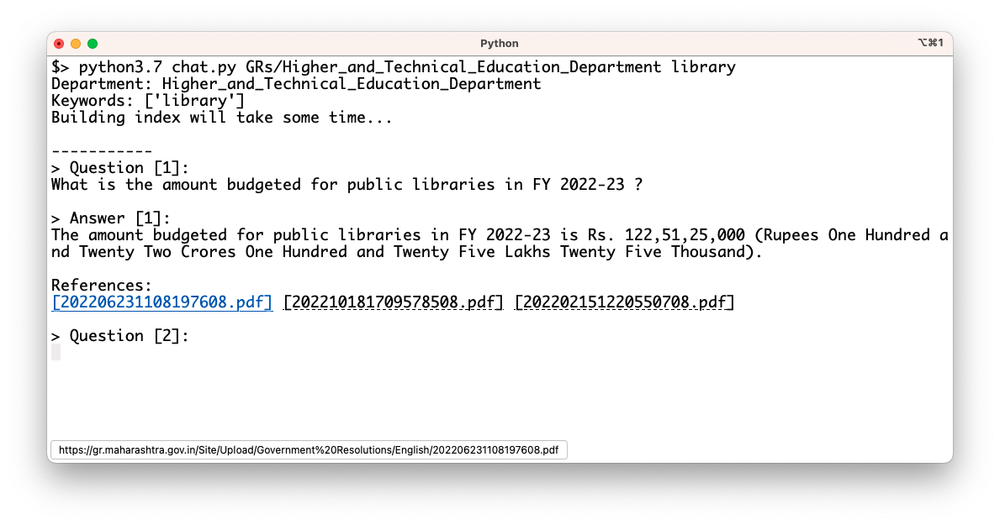

# Government Resolutions, Government of Maharashtra

This repository contains government resolutions issued by the Government of Maharashtra for the last five years, there are two files for each resolution 1) original marathi (txt file) and 2) english translation of that resolution (txt file). The original government resolutions can be found at https://gr.maharashtra.gov.in/1145/Government-Resolutions.


The English translation is obtained by processing each the pdf file of each Government Resolution through a pipeline where the following operations are performed 1) Download the file using crawler 2) OCR to handle non-standard fonts 3) paragraph detection 4) table  detection 5) translation to English. This pipeline is run in sepearate repositories check out orgpedia/mah* for each department.


## Data Details

| Num | Department Name | Start Date | Last Date | Last Crawl Date | # Marathi Orders | # Translated Orders | Starting Order | Last Order |
| --- | --------------- | ---------- | --------- | --------------- | ---------------- | ------------------- | -------------- | ---------- |
| 1 | [Agriculture, Dairy Development, Animal Husbandry and Fisheries Department](GRs/Agriculture,_Dairy_Development,_Animal_Husbandry_and_Fisheries_Department) | 16 March 2018 | 15 December 2023 | 16-Dec-2023 | 3624 | 3564 | [201803161624182101.pdf](https://gr.maharashtra.gov.in/Site/Upload/Government%20Resolutions/English/201803161624182101.pdf) | [202312151654308601.pdf](https://gr.maharashtra.gov.in/Site/Upload/Government%20Resolutions/English/202312151654308601.pdf) |
| 2 | [Co-operation, Textiles and Marketing Department](GRs/Co-operation,_Textiles_and_Marketing_Department) | 19 March 2018 | 15 December 2023 | 16-Dec-2023 | 2267 | 2226 | [201803191257576702.pdf](https://gr.maharashtra.gov.in/Site/Upload/Government%20Resolutions/English/201803191257576702.pdf) | [202312151651012002.pdf](https://gr.maharashtra.gov.in/Site/Upload/Government%20Resolutions/English/202312151651012002.pdf) |
| 3 | [Environment Department](GRs/Environment_Department) | 02 December 2017 | 09 November 2023 | 26-Nov-2023 | 336 | 327 | [201712041147216904.pdf](https://gr.maharashtra.gov.in/Site/Upload/Government%20Resolutions/English/201712041147216904.pdf) | [202311091716582504.pdf](https://gr.maharashtra.gov.in/Site/Upload/Government%20Resolutions/English/202311091716582504.pdf) |
| 4 | [Finance Department](GRs/Finance_Department) | 14 January 2021 | 08 December 2023 | 09-Dec-2023 | 615 | 609 | [202101141237329905.pdf](https://gr.maharashtra.gov.in/Site/Upload/Government%20Resolutions/English/202101141237329905.pdf) | [202312081246357605.pdf](https://gr.maharashtra.gov.in/Site/Upload/Government%20Resolutions/English/202312081246357605.pdf) |
| 5 | [Food, Civil Supplies and Consumer Protection Department](GRs/Food,_Civil_Supplies_and_Consumer_Protection_Department) | 05 February 2018 | 07 December 2023 | 09-Dec-2023 | 893 | 885 | [201802121244545806.pdf](https://gr.maharashtra.gov.in/Site/Upload/Government%20Resolutions/English/201802121244545806.pdf) | [202312071158127406.pdf](https://gr.maharashtra.gov.in/Site/Upload/Government%20Resolutions/English/202312071158127406.pdf) |
| 6 | [General Administration Department](GRs/General_Administration_Department) | 16 March 2018 | 15 December 2023 | 16-Dec-2023 | 4006 | 3986 | [201803161224022707.pdf](https://gr.maharashtra.gov.in/Site/Upload/Government%20Resolutions/English/201803161224022707.pdf) | [202312151559423607.pdf](https://gr.maharashtra.gov.in/Site/Upload/Government%20Resolutions/English/202312151559423607.pdf) |
| 7 | [Higher and Technical Education Department](GRs/Higher_and_Technical_Education_Department) | 12 October 2017 | 15 December 2023 | 16-Dec-2023 | 2322 | 2317 | [201710121514029708.pdf](https://gr.maharashtra.gov.in/Site/Upload/Government%20Resolutions/English/201710121514029708.pdf) | [202312151800149608.pdf](https://gr.maharashtra.gov.in/Site/Upload/Government%20Resolutions/English/202312151800149608.pdf) |
| 8 | [Home Department](GRs/Home_Department) | 22 October 2008 | 15 December 2023 | 16-Dec-2023 | 8081 | 3536 | [20081022.pdf](https://gr.maharashtra.gov.in/Site/Upload/Government%20Resolutions/English/20081022.pdf) | [202312151533427429.pdf](https://gr.maharashtra.gov.in/Site/Upload/Government%20Resolutions/English/202312151533427429.pdf) |
| 9 | [Housing Department](GRs/Housing_Department) | 16 November 2017 | 22 November 2023 | 26-Nov-2023 | 322 | 318 | [201711161447076609.pdf](https://gr.maharashtra.gov.in/Site/Upload/Government%20Resolutions/English/201711161447076609.pdf) | [202311221219205209.pdf](https://gr.maharashtra.gov.in/Site/Upload/Government%20Resolutions/English/202311221219205209.pdf) |
| 10 | [Industries, Energy and Labour Department](GRs/Industries,_Energy_and_Labour_Department) | 15 March 2018 | 15 December 2023 | 16-Dec-2023 | 1700 | 1695 | [201803151204055010.pdf](https://gr.maharashtra.gov.in/Site/Upload/Government%20Resolutions/English/201803151204055010.pdf) | [202312151150447710.pdf](https://gr.maharashtra.gov.in/Site/Upload/Government%20Resolutions/English/202312151150447710.pdf) |
| 11 | [Information Technology Department](GRs/Information_Technology_Department) | 20 January 2018 | 15 December 2023 | 16-Dec-2023 | 110 | 110 | [201801201843024511.pdf](https://gr.maharashtra.gov.in/Site/Upload/Government%20Resolutions/English/201801201843024511.pdf) | [202312151508137711.pdf](https://gr.maharashtra.gov.in/Site/Upload/Government%20Resolutions/English/202312151508137711.pdf) |
| 12 | [Law and Judiciary Department](GRs/Law_and_Judiciary_Department) | 17 March 2018 | 14 December 2023 | 16-Dec-2023 | 1656 | 1640 | [201803171129290212.pdf](https://gr.maharashtra.gov.in/Site/Upload/Government%20Resolutions/English/201803171129290212.pdf) | [202312151745503812.pdf](https://gr.maharashtra.gov.in/Site/Upload/Government%20Resolutions/English/202312151745503812.pdf) |
| 13 | [Marathi Language Department](GRs/Marathi_Language_Department) | 22 February 2018 | 15 December 2023 | 16-Dec-2023 | 302 | 300 | [201802031549154233.pdf](https://gr.maharashtra.gov.in/Site/Upload/Government%20Resolutions/English/201802031549154233.pdf) | [202312151735181633.pdf](https://gr.maharashtra.gov.in/Site/Upload/Government%20Resolutions/English/202312151735181633.pdf) |
| 14 | [Medical Education and Drugs Department](GRs/Medical_Education_and_Drugs_Department) | 12 March 2018 | 15 December 2023 | 16-Dec-2023 | 958 | 914 | [201803121137094813.pdf](https://gr.maharashtra.gov.in/Site/Upload/Government%20Resolutions/English/201803121137094813.pdf) | [202312151045223413.pdf](https://gr.maharashtra.gov.in/Site/Upload/Government%20Resolutions/English/202312151045223413.pdf) |
| 15 | [Minorities Development Department](GRs/Minorities_Development_Department) | 09 March 2018 | 05 December 2023 | 09-Dec-2023 | 844 | 839 | [201803091218355314.pdf](https://gr.maharashtra.gov.in/Site/Upload/Government%20Resolutions/English/201803091218355314.pdf) | [202312051810102714.pdf](https://gr.maharashtra.gov.in/Site/Upload/Government%20Resolutions/English/202312051810102714.pdf) |
| 16 | [Other Backward Bahujan Welfare Department](GRs/Other_Backward_Bahujan_Welfare_Department) | 07 March 2022 | 15 December 2023 | 16-Dec-2023 | 436 | 434 | [202203081752439334.pdf](https://gr.maharashtra.gov.in/Site/Upload/Government%20Resolutions/English/202203081752439334.pdf) | [202312151851023034.pdf](https://gr.maharashtra.gov.in/Site/Upload/Government%20Resolutions/English/202312151851023034.pdf) |
| 17 | [Parliamentary Affairs Department](GRs/Parliamentary_Affairs_Department) | 12 October 2017 | 22 November 2023 | 26-Nov-2023 | 105 | 105 | [201710031642378615.pdf](https://gr.maharashtra.gov.in/Site/Upload/Government%20Resolutions/English/201710031642378615.pdf) | [202311221247565415.pdf](https://gr.maharashtra.gov.in/Site/Upload/Government%20Resolutions/English/202311221247565415.pdf) |
| 18 | [Persons with Disabilities Welfare Department](GRs/Persons_with_Disabilities_Welfare_Department) | 04 January 2023 | 28 November 2023 | 03-Dec-2023 | 42 | 42 | [202301041906309635.pdf](https://gr.maharashtra.gov.in/Site/Upload/Government%20Resolutions/English/202301041906309635.pdf) | [202311281605117035.pdf](https://gr.maharashtra.gov.in/Site/Upload/Government%20Resolutions/English/202311281605117035.pdf) |
| 19 | [Planning Department](GRs/Planning_Department) | 09 March 2018 | 14 December 2023 | 16-Dec-2023 | 1366 | 1346 | [201803091441032716.pdf](https://gr.maharashtra.gov.in/Site/Upload/Government%20Resolutions/English/201803091441032716.pdf) | [202312141041322616.pdf](https://gr.maharashtra.gov.in/Site/Upload/Government%20Resolutions/English/202312141041322616.pdf) |
| 20 | [Public Health Department](GRs/Public_Health_Department) | 08 February 2018 | 14 December 2023 | 16-Dec-2023 | 5194 | 5157 | [201801311722275417.pdf](https://gr.maharashtra.gov.in/Site/Upload/Government%20Resolutions/English/201801311722275417.pdf) | [202312141132349117.pdf](https://gr.maharashtra.gov.in/Site/Upload/Government%20Resolutions/English/202312141132349117.pdf) |
| 21 | [Public Works Department](GRs/Public_Works_Department) | 05 March 2018 | 14 December 2023 | 16-Dec-2023 | 2856 | 2847 | [201803051515468118.pdf](https://gr.maharashtra.gov.in/Site/Upload/Government%20Resolutions/English/201803051515468118.pdf) | [202312141828469718.pdf](https://gr.maharashtra.gov.in/Site/Upload/Government%20Resolutions/English/202312141828469718.pdf) |
| 22 | [Revenue and Forest Department](GRs/Revenue_and_Forest_Department) | 23 March 2021 | 14 December 2023 | 16-Dec-2023 | 2759 | 2724 | [202103231328393119.pdf](https://gr.maharashtra.gov.in/Site/Upload/Government%20Resolutions/English/202103231328393119.pdf) | [202312141706541719.pdf](https://gr.maharashtra.gov.in/Site/Upload/Government%20Resolutions/English/202312141706541719.pdf) |
| 23 | [Rural Development Department](GRs/Rural_Development_Department) | 31 March 2021 | 13 December 2023 | 16-Dec-2023 | 1306 | 1184 | [202103301021181120.pdf](https://gr.maharashtra.gov.in/Site/Upload/Government%20Resolutions/English/202103301021181120.pdf) | [202312131053574220.pdf](https://gr.maharashtra.gov.in/Site/Upload/Government%20Resolutions/English/202312131053574220.pdf) |
| 24 | [School Education and Sports Department](GRs/School_Education_and_Sports_Department) | 15 May 2018 | 15 December 2023 | 16-Dec-2023 | 3309 | 3291 | [201805161114241221.pdf](https://gr.maharashtra.gov.in/Site/Upload/Government%20Resolutions/English/201805161114241221.pdf) | [202312151704238621.pdf](https://gr.maharashtra.gov.in/Site/Upload/Government%20Resolutions/English/202312151704238621.pdf) |
| 25 | [Skill Development and Entrepreneurship Department](GRs/Skill_Development_and_Entrepreneurship_Department) | 17 March 2018 | 14 December 2023 | 16-Dec-2023 | 863 | 860 | [201803171322099003.pdf](https://gr.maharashtra.gov.in/Site/Upload/Government%20Resolutions/English/201803171322099003.pdf) | [202312141458070303.pdf](https://gr.maharashtra.gov.in/Site/Upload/Government%20Resolutions/English/202312141458070303.pdf) |
| 26 | [Social Justice and Special Assistance Department](GRs/Social_Justice_and_Special_Assistance_Department) | 03 December 2019 | 08 December 2023 | 09-Dec-2023 | 1159 | 1156 | [201912051107011622.pdf](https://gr.maharashtra.gov.in/Site/Upload/Government%20Resolutions/English/201912051107011622.pdf) | [202312081753231422.pdf](https://gr.maharashtra.gov.in/Site/Upload/Government%20Resolutions/English/202312081753231422.pdf) |
| 27 | [Soil and Water Conservation Department](GRs/Soil_and_Water_Conservation_Department) | 16 March 2018 | 12 December 2023 | 16-Dec-2023 | 1891 | 1815 | [201803161247582426.pdf](https://gr.maharashtra.gov.in/Site/Upload/Government%20Resolutions/English/201803161247582426.pdf) | [202312121054300926.pdf](https://gr.maharashtra.gov.in/Site/Upload/Government%20Resolutions/English/202312121054300926.pdf) |
| 28 | [Tourism and Cultural Affairs Department](GRs/Tourism_and_Cultural_Affairs_Department) | 14 March 2018 | 14 December 2023 | 16-Dec-2023 | 877 | 868 | [201803131542054523.pdf](https://gr.maharashtra.gov.in/Site/Upload/Government%20Resolutions/English/201803131542054523.pdf) | [202312141725274923.pdf](https://gr.maharashtra.gov.in/Site/Upload/Government%20Resolutions/English/202312141725274923.pdf) |
| 29 | [Tribal Development Department](GRs/Tribal_Development_Department) | 14 March 2018 | 15 December 2023 | 16-Dec-2023 | 1729 | 1707 | [201803091105184924.pdf](https://gr.maharashtra.gov.in/Site/Upload/Government%20Resolutions/English/201803091105184924.pdf) | [202312151218010724.pdf](https://gr.maharashtra.gov.in/Site/Upload/Government%20Resolutions/English/202312151218010724.pdf) |
| 30 | [Urban Development Department](GRs/Urban_Development_Department) | 07 March 2018 | 15 December 2023 | 16-Dec-2023 | 2153 | 2148 | [201803071203178325.pdf](https://gr.maharashtra.gov.in/Site/Upload/Government%20Resolutions/English/201803071203178325.pdf) | [202312151213187225.pdf](https://gr.maharashtra.gov.in/Site/Upload/Government%20Resolutions/English/202312151213187225.pdf) |
| 31 | [Water Resources Department](GRs/Water_Resources_Department) | 09 March 2018 | 15 December 2023 | 16-Dec-2023 | 2402 | 2394 | [201803091034435527.pdf](https://gr.maharashtra.gov.in/Site/Upload/Government%20Resolutions/English/201803091034435527.pdf) | [202312151724140727.pdf](https://gr.maharashtra.gov.in/Site/Upload/Government%20Resolutions/English/202312151724140727.pdf) |
| 32 | [Water Supply and Sanitation Department](GRs/Water_Supply_and_Sanitation_Department) | 13 March 2018 | 15 December 2023 | 16-Dec-2023 | 3243 | 3199 | [201803121414108428.pdf](https://gr.maharashtra.gov.in/Site/Upload/Government%20Resolutions/English/201803121414108428.pdf) | [202312151310482628.pdf](https://gr.maharashtra.gov.in/Site/Upload/Government%20Resolutions/English/202312151310482628.pdf) |
| 33 | [Women and Child Development Department](GRs/Women_and_Child_Development_Department) | 17 March 2018 | 13 December 2023 | 16-Dec-2023 | 1162 | 1141 | [201803171539444330.pdf](https://gr.maharashtra.gov.in/Site/Upload/Government%20Resolutions/English/201803171539444330.pdf) | [202312131053328830.pdf](https://gr.maharashtra.gov.in/Site/Upload/Government%20Resolutions/English/202312131053328830.pdf) |
----------------------------------------------------------------------------------------------------

**Total Orders**: 60,888 and **Total Translated Orders**: 55,684
## Accessing Data

The easist way to access the data is to clone the repository or download the data as a zip file (Click the green button '< > Code' at the top. All the files are arranged as per department and are in the [GRs](GRs) directory.

Please note that the repository even though it contains only txt file is about 1GB in size.

## Running Chatbot

You can run a simple Q & A chatbot on this data using [chat.py](chat.py), a simple chat applications that has no external depedencies and requires you to run [Qdrant](https://qdrant.tech/) vector database, have need to have `curl` on your machine and have an [OpenAI API Key](https://help.openai.com/en/articles/4936850-where-do-i-find-my-secret-api-key).

Start qdrant on your local machine
```shell
docker pull qdrant/qdrant
docker run -p 6333:6333 qdrant/qdrant
```

Provide Open AI API Key, this chat app uses two APIs embeddings and completions.
```shell
export OPENAI_API_KEY='XXX'
```

This will start the chat app on all the orders (GRs) that have 'library' keyword in their subject.

```shell
python chat.py GRs/Higher_and_Technical_Education_Department library
```



* You get clickable links in references if you run in iTerm2 *.

## Thanks

Orgpedia would like to thank [AI4Bharat](https://ai4bharat.iitm.ac.in/) for releasing [IndicTrans2](https://github.com/AI4Bharat/IndicTrans2).

Thanks to its accuracy and performance Orgpedia was able to translate over 50,000 documents relatively quickly and at a fraction of the price of the online servicess.


