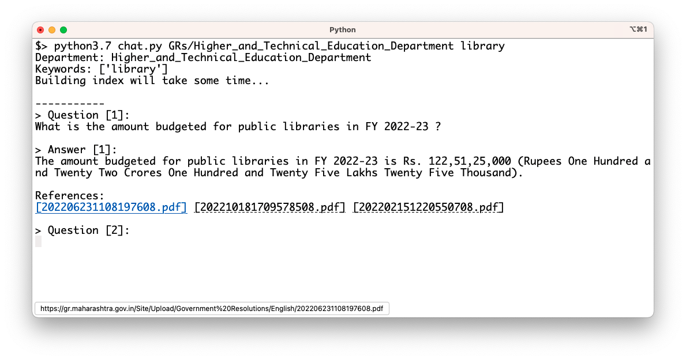

# Government Resolutions, Government of Maharashtra

This repository contains government resolutions issued by the Government of Maharashtra for the last five years, there are two files for each resolution 1) original marathi (txt file) and 2) english translation of that resolution (txt file). The original government resolutions can be found at https://gr.maharashtra.gov.in/1145/Government-Resolutions.

The English translation is obtained by processing each the pdf file of each Government Resolution through a pipeline where the following operations are performed 1) Download the file using crawler 2) OCR to handle non-standard fonts 3) paragraph detection 4) table  detection 5) translation to English. This pipeline is run in sepearate repositories check out orgpedia/mah* for each department.


## Data Details

| Num | Department Name | Start Date | Last Date | # Marathi Orders | # Translated Orders | Starting Order | Last Order |
| --- | --------------- | ---------- | --------- | ---------------- | ------------------- | -------------- | ---------- |
| 1 | Agriculture, Dairy Development, Animal Husbandry and Fisheries Department | 16 Mar 2018 | 11 Mar 2026 | 4895 | 4895 | [201803161624182101.pdf](https://gr.maharashtra.gov.in/Site/Upload/Government%20Resolutions/English/201803161624182101.pdf) [mr](GRs/Agriculture,_Dairy_Development,_Animal_Husbandry_and_Fisheries_Department/201803161624182101.pdf.mr.txt) [en](GRs/Agriculture,_Dairy_Development,_Animal_Husbandry_and_Fisheries_Department/201803161624182101.pdf.en.txt) | [202603111726503401.pdf](https://gr.maharashtra.gov.in/Site/Upload/Government%20Resolutions/English/202603111726503401.pdf) [mr](GRs/Agriculture,_Dairy_Development,_Animal_Husbandry_and_Fisheries_Department/202603111726503401.pdf.mr.txt) [en](GRs/Agriculture,_Dairy_Development,_Animal_Husbandry_and_Fisheries_Department/202603111726503401.pdf.en.txt) |
| 2 | Co-operation, Textiles and Marketing Department | 19 Mar 2018 | 11 Mar 2026 | 3193 | 3193 | [201803191257576702.pdf](https://gr.maharashtra.gov.in/Site/Upload/Government%20Resolutions/English/201803191257576702.pdf) [mr](GRs/Co-operation,_Textiles_and_Marketing_Department/201803191257576702.pdf.mr.txt) [en](GRs/Co-operation,_Textiles_and_Marketing_Department/201803191257576702.pdf.en.txt) | [202603111649152102.pdf](https://gr.maharashtra.gov.in/Site/Upload/Government%20Resolutions/English/202603111649152102.pdf) [mr](GRs/Co-operation,_Textiles_and_Marketing_Department/202603111649152102.pdf.mr.txt) [en](GRs/Co-operation,_Textiles_and_Marketing_Department/202603111649152102.pdf.en.txt) |
| 3 | Environment Department | 02 Dec 2017 | 20 Feb 2026 | 800 | 800 | [201712041147216904.pdf](https://gr.maharashtra.gov.in/Site/Upload/Government%20Resolutions/English/201712041147216904.pdf) [mr](GRs/Environment_Department/201712041147216904.pdf.mr.txt) [en](GRs/Environment_Department/201712041147216904.pdf.en.txt) | [202602201706198704.pdf](https://gr.maharashtra.gov.in/Site/Upload/Government%20Resolutions/English/202602201706198704.pdf) [mr](GRs/Environment_Department/202602201706198704.pdf.mr.txt) [en](GRs/Environment_Department/202602201706198704.pdf.en.txt) |
| 4 | Finance Department | 14 Jan 2021 | 11 Mar 2026 | 926 | 926 | [202101141237329905.pdf](https://gr.maharashtra.gov.in/Site/Upload/Government%20Resolutions/English/202101141237329905.pdf) [mr](GRs/Finance_Department/202101141237329905.pdf.mr.txt) [en](GRs/Finance_Department/202101141237329905.pdf.en.txt) | [202603111546589705.pdf](https://gr.maharashtra.gov.in/Site/Upload/Government%20Resolutions/English/202603111546589705.pdf) [mr](GRs/Finance_Department/202603111546589705.pdf.mr.txt) [en](GRs/Finance_Department/202603111546589705.pdf.en.txt) |
| 5 | Food, Civil Supplies and Consumer Protection Department | 05 Feb 2018 | 11 Mar 2026 | 1361 | 1361 | [201802121244545806.pdf](https://gr.maharashtra.gov.in/Site/Upload/Government%20Resolutions/English/201802121244545806.pdf) [mr](GRs/Food,_Civil_Supplies_and_Consumer_Protection_Department/201802121244545806.pdf.mr.txt) [en](GRs/Food,_Civil_Supplies_and_Consumer_Protection_Department/201802121244545806.pdf.en.txt) | [202603111336099306.pdf](https://gr.maharashtra.gov.in/Site/Upload/Government%20Resolutions/English/202603111336099306.pdf) [mr](GRs/Food,_Civil_Supplies_and_Consumer_Protection_Department/202603111336099306.pdf.mr.txt) [en](GRs/Food,_Civil_Supplies_and_Consumer_Protection_Department/202603111336099306.pdf.en.txt) |
| 6 | General Administration Department | 16 Mar 2018 | 11 Mar 2026 | 5907 | 5907 | [201803161224022707.pdf](https://gr.maharashtra.gov.in/Site/Upload/Government%20Resolutions/English/201803161224022707.pdf) [mr](GRs/General_Administration_Department/201803161224022707.pdf.mr.txt) [en](GRs/General_Administration_Department/201803161224022707.pdf.en.txt) | [202603111759066007.pdf](https://gr.maharashtra.gov.in/Site/Upload/Government%20Resolutions/English/202603111759066007.pdf) [mr](GRs/General_Administration_Department/202603111759066007.pdf.mr.txt) [en](GRs/General_Administration_Department/202603111759066007.pdf.en.txt) |
| 7 | Higher and Technical Education Department | 12 Oct 2017 | 11 Mar 2026 | 4074 | 4074 | [201710121514029708.pdf](https://gr.maharashtra.gov.in/Site/Upload/Government%20Resolutions/English/201710121514029708.pdf) [mr](GRs/Higher_and_Technical_Education_Department/201710121514029708.pdf.mr.txt) [en](GRs/Higher_and_Technical_Education_Department/201710121514029708.pdf.en.txt) | [202603111745571908.pdf](https://gr.maharashtra.gov.in/Site/Upload/Government%20Resolutions/English/202603111745571908.pdf) [mr](GRs/Higher_and_Technical_Education_Department/202603111745571908.pdf.mr.txt) [en](GRs/Higher_and_Technical_Education_Department/202603111745571908.pdf.en.txt) |
| 8 | Home Department | 22 Mar 1947 | 11 Mar 2026 | 5253 | 5253 | [201210191648552129.pdf](https://gr.maharashtra.gov.in/Site/Upload/Government%20Resolutions/English/201210191648552129.pdf) [mr](GRs/Home_Department/201210191648552129.pdf.mr.txt) [en](GRs/Home_Department/201210191648552129.pdf.en.txt) | [202603111149575929.pdf](https://gr.maharashtra.gov.in/Site/Upload/Government%20Resolutions/English/202603111149575929.pdf) [mr](GRs/Home_Department/202603111149575929.pdf.mr.txt) [en](GRs/Home_Department/202603111149575929.pdf.en.txt) |
| 9 | Housing Department | 16 Nov 2017 | 11 Mar 2026 | 460 | 460 | [201711161447076609.pdf](https://gr.maharashtra.gov.in/Site/Upload/Government%20Resolutions/English/201711161447076609.pdf) [mr](GRs/Housing_Department/201711161447076609.pdf.mr.txt) [en](GRs/Housing_Department/201711161447076609.pdf.en.txt) | [202603111453516209.pdf](https://gr.maharashtra.gov.in/Site/Upload/Government%20Resolutions/English/202603111453516209.pdf) [mr](GRs/Housing_Department/202603111453516209.pdf.mr.txt) [en](GRs/Housing_Department/202603111453516209.pdf.en.txt) |
| 10 | Industries, Energy and Labour Department | 15 Mar 2018 | 11 Mar 2026 | 2644 | 2644 | [201803151204055010.pdf](https://gr.maharashtra.gov.in/Site/Upload/Government%20Resolutions/English/201803151204055010.pdf) [mr](GRs/Industries,_Energy_and_Labour_Department/201803151204055010.pdf.mr.txt) [en](GRs/Industries,_Energy_and_Labour_Department/201803151204055010.pdf.en.txt) | [202603111305036210.pdf](https://gr.maharashtra.gov.in/Site/Upload/Government%20Resolutions/English/202603111305036210.pdf) [mr](GRs/Industries,_Energy_and_Labour_Department/202603111305036210.pdf.mr.txt) [en](GRs/Industries,_Energy_and_Labour_Department/202603111305036210.pdf.en.txt) |
| 11 | Information Technology Department | 20 Jan 2018 | 19 Jul 2024 | 112 | 112 | [201801201843024511.pdf](https://gr.maharashtra.gov.in/Site/Upload/Government%20Resolutions/English/201801201843024511.pdf) [mr](GRs/Information_Technology_Department/201801201843024511.pdf.mr.txt) [en](GRs/Information_Technology_Department/201801201843024511.pdf.en.txt) | [202407191742379111.pdf](https://gr.maharashtra.gov.in/Site/Upload/Government%20Resolutions/English/202407191742379111.pdf) [mr](GRs/Information_Technology_Department/202407191742379111.pdf.mr.txt) [en](GRs/Information_Technology_Department/202407191742379111.pdf.en.txt) |
| 12 | Law and Judiciary Department | 17 Mar 2018 | 11 Mar 2026 | 2557 | 2557 | [201803171129290212.pdf](https://gr.maharashtra.gov.in/Site/Upload/Government%20Resolutions/English/201803171129290212.pdf) [mr](GRs/Law_and_Judiciary_Department/201803171129290212.pdf.mr.txt) [en](GRs/Law_and_Judiciary_Department/201803171129290212.pdf.en.txt) | [202603111627101312.pdf](https://gr.maharashtra.gov.in/Site/Upload/Government%20Resolutions/English/202603111627101312.pdf) [mr](GRs/Law_and_Judiciary_Department/202603111627101312.pdf.mr.txt) [en](GRs/Law_and_Judiciary_Department/202603111627101312.pdf.en.txt) |
| 13 | Marathi Language Department | 22 Feb 2018 | 10 Mar 2026 | 440 | 440 | [201802031549154233.pdf](https://gr.maharashtra.gov.in/Site/Upload/Government%20Resolutions/English/201802031549154233.pdf) [mr](GRs/Marathi_Language_Department/201802031549154233.pdf.mr.txt) [en](GRs/Marathi_Language_Department/201802031549154233.pdf.en.txt) | [202603101534112533.pdf](https://gr.maharashtra.gov.in/Site/Upload/Government%20Resolutions/English/202603101534112533.pdf) [mr](GRs/Marathi_Language_Department/202603101534112533.pdf.mr.txt) [en](GRs/Marathi_Language_Department/202603101534112533.pdf.en.txt) |
| 14 | Medical Education and Drugs Department | 05 Mar 2018 | 10 Mar 2026 | 1811 | 1811 | [201805221424292513.pdf](https://gr.maharashtra.gov.in/Site/Upload/Government%20Resolutions/English/201805221424292513.pdf) [mr](GRs/Medical_Education_and_Drugs_Department/201805221424292513.pdf.mr.txt) [en](GRs/Medical_Education_and_Drugs_Department/201805221424292513.pdf.en.txt) | [202603101733358613.pdf](https://gr.maharashtra.gov.in/Site/Upload/Government%20Resolutions/English/202603101733358613.pdf) [mr](GRs/Medical_Education_and_Drugs_Department/202603101733358613.pdf.mr.txt) [en](GRs/Medical_Education_and_Drugs_Department/202603101733358613.pdf.en.txt) |
| 15 | Minorities Development Department | 09 Mar 2018 | 06 Mar 2026 | 1171 | 1171 | [201803091218355314.pdf](https://gr.maharashtra.gov.in/Site/Upload/Government%20Resolutions/English/201803091218355314.pdf) [mr](GRs/Minorities_Development_Department/201803091218355314.pdf.mr.txt) [en](GRs/Minorities_Development_Department/201803091218355314.pdf.en.txt) | [202603061250079714.pdf](https://gr.maharashtra.gov.in/Site/Upload/Government%20Resolutions/English/202603061250079714.pdf) [mr](GRs/Minorities_Development_Department/202603061250079714.pdf.mr.txt) [en](GRs/Minorities_Development_Department/202603061250079714.pdf.en.txt) |
| 16 | Other Backward Bahujan Welfare Department | 07 Mar 2022 | 11 Mar 2026 | 1543 | 1543 | [202203081752439334.pdf](https://gr.maharashtra.gov.in/Site/Upload/Government%20Resolutions/English/202203081752439334.pdf) [mr](GRs/Other_Backward_Bahujan_Welfare_Department/202203081752439334.pdf.mr.txt) [en](GRs/Other_Backward_Bahujan_Welfare_Department/202203081752439334.pdf.en.txt) | [202603111532598334.pdf](https://gr.maharashtra.gov.in/Site/Upload/Government%20Resolutions/English/202603111532598334.pdf) [mr](GRs/Other_Backward_Bahujan_Welfare_Department/202603111532598334.pdf.mr.txt) [en](GRs/Other_Backward_Bahujan_Welfare_Department/202603111532598334.pdf.en.txt) |
| 17 | Parliamentary Affairs Department | 12 Oct 2017 | 10 Feb 2026 | 123 | 123 | [201710031642378615.pdf](https://gr.maharashtra.gov.in/Site/Upload/Government%20Resolutions/English/201710031642378615.pdf) [mr](GRs/Parliamentary_Affairs_Department/201710031642378615.pdf.mr.txt) [en](GRs/Parliamentary_Affairs_Department/201710031642378615.pdf.en.txt) | [202602101126464715.pdf](https://gr.maharashtra.gov.in/Site/Upload/Government%20Resolutions/English/202602101126464715.pdf) [mr](GRs/Parliamentary_Affairs_Department/202602101126464715.pdf.mr.txt) [en](GRs/Parliamentary_Affairs_Department/202602101126464715.pdf.en.txt) |
| 18 | Persons with Disabilities Welfare Department | 04 Jan 2023 | 09 Mar 2026 | 188 | 188 | [202301041906309635.pdf](https://gr.maharashtra.gov.in/Site/Upload/Government%20Resolutions/English/202301041906309635.pdf) [mr](GRs/Persons_with_Disabilities_Welfare_Department/202301041906309635.pdf.mr.txt) [en](GRs/Persons_with_Disabilities_Welfare_Department/202301041906309635.pdf.en.txt) | [202603091254311035.pdf](https://gr.maharashtra.gov.in/Site/Upload/Government%20Resolutions/English/202603091254311035.pdf) [mr](GRs/Persons_with_Disabilities_Welfare_Department/202603091254311035.pdf.mr.txt) [en](GRs/Persons_with_Disabilities_Welfare_Department/202603091254311035.pdf.en.txt) |
| 19 | Planning Department | 09 Mar 2018 | 11 Mar 2026 | 2052 | 2052 | [201803091441032716.pdf](https://gr.maharashtra.gov.in/Site/Upload/Government%20Resolutions/English/201803091441032716.pdf) [mr](GRs/Planning_Department/201803091441032716.pdf.mr.txt) [en](GRs/Planning_Department/201803091441032716.pdf.en.txt) | [202603111511355316.pdf](https://gr.maharashtra.gov.in/Site/Upload/Government%20Resolutions/English/202603111511355316.pdf) [mr](GRs/Planning_Department/202603111511355316.pdf.mr.txt) [en](GRs/Planning_Department/202603111511355316.pdf.en.txt) |
| 20 | Public Health Department | 08 Feb 2018 | 06 Mar 2026 | 6812 | 6812 | [201801311722275417.pdf](https://gr.maharashtra.gov.in/Site/Upload/Government%20Resolutions/English/201801311722275417.pdf) [mr](GRs/Public_Health_Department/201801311722275417.pdf.mr.txt) [en](GRs/Public_Health_Department/201801311722275417.pdf.en.txt) | [202603061734411817.pdf](https://gr.maharashtra.gov.in/Site/Upload/Government%20Resolutions/English/202603061734411817.pdf) [mr](GRs/Public_Health_Department/202603061734411817.pdf.mr.txt) [en](GRs/Public_Health_Department/202603061734411817.pdf.en.txt) |
| 21 | Public Works Department | 05 Mar 2018 | 09 Mar 2026 | 3618 | 3618 | [201803051515468118.pdf](https://gr.maharashtra.gov.in/Site/Upload/Government%20Resolutions/English/201803051515468118.pdf) [mr](GRs/Public_Works_Department/201803051515468118.pdf.mr.txt) [en](GRs/Public_Works_Department/201803051515468118.pdf.en.txt) | [202603091644389318.pdf](https://gr.maharashtra.gov.in/Site/Upload/Government%20Resolutions/English/202603091644389318.pdf) [mr](GRs/Public_Works_Department/202603091644389318.pdf.mr.txt) [en](GRs/Public_Works_Department/202603091644389318.pdf.en.txt) |
| 22 | Revenue and Forest Department | 23 Mar 2021 | 11 Mar 2026 | 6870 | 6870 | [202103231328393119.pdf](https://gr.maharashtra.gov.in/Site/Upload/Government%20Resolutions/English/202103231328393119.pdf) [mr](GRs/Revenue_and_Forest_Department/202103231328393119.pdf.mr.txt) [en](GRs/Revenue_and_Forest_Department/202103231328393119.pdf.en.txt) | [202603111853368419.pdf](https://gr.maharashtra.gov.in/Site/Upload/Government%20Resolutions/English/202603111853368419.pdf) [mr](GRs/Revenue_and_Forest_Department/202603111853368419.pdf.mr.txt) [en](GRs/Revenue_and_Forest_Department/202603111853368419.pdf.en.txt) |
| 23 | Rural Development Department | 31 Mar 2021 | 11 Mar 2026 | 2812 | 2812 | [202103301021181120.pdf](https://gr.maharashtra.gov.in/Site/Upload/Government%20Resolutions/English/202103301021181120.pdf) [mr](GRs/Rural_Development_Department/202103301021181120.pdf.mr.txt) [en](GRs/Rural_Development_Department/202103301021181120.pdf.en.txt) | [202603111743092820.pdf](https://gr.maharashtra.gov.in/Site/Upload/Government%20Resolutions/English/202603111743092820.pdf) [mr](GRs/Rural_Development_Department/202603111743092820.pdf.mr.txt) [en](GRs/Rural_Development_Department/202603111743092820.pdf.en.txt) |
| 24 | School Education and Sports Department | 15 May 2018 | 11 Mar 2026 | 4935 | 4935 | [201805161114241221.pdf](https://gr.maharashtra.gov.in/Site/Upload/Government%20Resolutions/English/201805161114241221.pdf) [mr](GRs/School_Education_and_Sports_Department/201805161114241221.pdf.mr.txt) [en](GRs/School_Education_and_Sports_Department/201805161114241221.pdf.en.txt) | [202603111912557721.pdf](https://gr.maharashtra.gov.in/Site/Upload/Government%20Resolutions/English/202603111912557721.pdf) [mr](GRs/School_Education_and_Sports_Department/202603111912557721.pdf.mr.txt) [en](GRs/School_Education_and_Sports_Department/202603111912557721.pdf.en.txt) |
| 25 | Skill Development and Entrepreneurship Department | 17 Mar 2018 | 10 Mar 2026 | 1232 | 1232 | [201803171322099003.pdf](https://gr.maharashtra.gov.in/Site/Upload/Government%20Resolutions/English/201803171322099003.pdf) [mr](GRs/Skill_Development_and_Entrepreneurship_Department/201803171322099003.pdf.mr.txt) [en](GRs/Skill_Development_and_Entrepreneurship_Department/201803171322099003.pdf.en.txt) | [202603101728083103.pdf](https://gr.maharashtra.gov.in/Site/Upload/Government%20Resolutions/English/202603101728083103.pdf) [mr](GRs/Skill_Development_and_Entrepreneurship_Department/202603101728083103.pdf.mr.txt) [en](GRs/Skill_Development_and_Entrepreneurship_Department/202603101728083103.pdf.en.txt) |
| 26 | Social Justice and Special Assistance Department | 03 Dec 2019 | 10 Mar 2026 | 2072 | 2072 | [201912051107011622.pdf](https://gr.maharashtra.gov.in/Site/Upload/Government%20Resolutions/English/201912051107011622.pdf) [mr](GRs/Social_Justice_and_Special_Assistance_Department/201912051107011622.pdf.mr.txt) [en](GRs/Social_Justice_and_Special_Assistance_Department/201912051107011622.pdf.en.txt) | [202603101257125222.pdf](https://gr.maharashtra.gov.in/Site/Upload/Government%20Resolutions/English/202603101257125222.pdf) [mr](GRs/Social_Justice_and_Special_Assistance_Department/202603101257125222.pdf.mr.txt) [en](GRs/Social_Justice_and_Special_Assistance_Department/202603101257125222.pdf.en.txt) |
| 27 | Soil and Water Conservation Department | 16 Mar 2018 | 11 Mar 2026 | 2646 | 2646 | [201803161247582426.pdf](https://gr.maharashtra.gov.in/Site/Upload/Government%20Resolutions/English/201803161247582426.pdf) [mr](GRs/Soil_and_Water_Conservation_Department/201803161247582426.pdf.mr.txt) [en](GRs/Soil_and_Water_Conservation_Department/201803161247582426.pdf.en.txt) | [202603111236287226.pdf](https://gr.maharashtra.gov.in/Site/Upload/Government%20Resolutions/English/202603111236287226.pdf) [mr](GRs/Soil_and_Water_Conservation_Department/202603111236287226.pdf.mr.txt) [en](GRs/Soil_and_Water_Conservation_Department/202603111236287226.pdf.en.txt) |
| 28 | Tourism and Cultural Affairs Department | 06 Mar 2018 | 11 Mar 2026 | 2175 | 2175 | [201803151055091823.pdf](https://gr.maharashtra.gov.in/Site/Upload/Government%20Resolutions/English/201803151055091823.pdf) [mr](GRs/Tourism_and_Cultural_Affairs_Department/201803151055091823.pdf.mr.txt) [en](GRs/Tourism_and_Cultural_Affairs_Department/201803151055091823.pdf.en.txt) | [202603111501504823.pdf](https://gr.maharashtra.gov.in/Site/Upload/Government%20Resolutions/English/202603111501504823.pdf) [mr](GRs/Tourism_and_Cultural_Affairs_Department/202603111501504823.pdf.mr.txt) [en](GRs/Tourism_and_Cultural_Affairs_Department/202603111501504823.pdf.en.txt) |
| 29 | Tribal Development Department | 14 Mar 2018 | 11 Mar 2026 | 2377 | 2377 | [201803091105184924.pdf](https://gr.maharashtra.gov.in/Site/Upload/Government%20Resolutions/English/201803091105184924.pdf) [mr](GRs/Tribal_Development_Department/201803091105184924.pdf.mr.txt) [en](GRs/Tribal_Development_Department/201803091105184924.pdf.en.txt) | [202603111632191924.pdf](https://gr.maharashtra.gov.in/Site/Upload/Government%20Resolutions/English/202603111632191924.pdf) [mr](GRs/Tribal_Development_Department/202603111632191924.pdf.mr.txt) [en](GRs/Tribal_Development_Department/202603111632191924.pdf.en.txt) |
| 30 | Urban Development Department | 07 Mar 2018 | 10 Mar 2026 | 4122 | 4122 | [201803071203178325.pdf](https://gr.maharashtra.gov.in/Site/Upload/Government%20Resolutions/English/201803071203178325.pdf) [mr](GRs/Urban_Development_Department/201803071203178325.pdf.mr.txt) [en](GRs/Urban_Development_Department/201803071203178325.pdf.en.txt) | [202603101710068925.pdf](https://gr.maharashtra.gov.in/Site/Upload/Government%20Resolutions/English/202603101710068925.pdf) [mr](GRs/Urban_Development_Department/202603101710068925.pdf.mr.txt) [en](GRs/Urban_Development_Department/202603101710068925.pdf.en.txt) |
| 31 | Water Resources Department | 09 Mar 2018 | 11 Mar 2026 | 3481 | 3481 | [201803091034435527.pdf](https://gr.maharashtra.gov.in/Site/Upload/Government%20Resolutions/English/201803091034435527.pdf) [mr](GRs/Water_Resources_Department/201803091034435527.pdf.mr.txt) [en](GRs/Water_Resources_Department/201803091034435527.pdf.en.txt) | [202603111812483327.pdf](https://gr.maharashtra.gov.in/Site/Upload/Government%20Resolutions/English/202603111812483327.pdf) [mr](GRs/Water_Resources_Department/202603111812483327.pdf.mr.txt) [en](GRs/Water_Resources_Department/202603111812483327.pdf.en.txt) |
| 32 | Water Supply and Sanitation Department | 13 Mar 2018 | 10 Mar 2026 | 8000 | 8000 | [201803121414108428.pdf](https://gr.maharashtra.gov.in/Site/Upload/Government%20Resolutions/English/201803121414108428.pdf) [mr](GRs/Water_Supply_and_Sanitation_Department/201803121414108428.pdf.mr.txt) [en](GRs/Water_Supply_and_Sanitation_Department/201803121414108428.pdf.en.txt) | [202603101739361628.pdf](https://gr.maharashtra.gov.in/Site/Upload/Government%20Resolutions/English/202603101739361628.pdf) [mr](GRs/Water_Supply_and_Sanitation_Department/202603101739361628.pdf.mr.txt) [en](GRs/Water_Supply_and_Sanitation_Department/202603101739361628.pdf.en.txt) |
| 33 | Women and Child Development Department | 17 Mar 2018 | 06 Mar 2026 | 1759 | 1759 | [201803171539444330.pdf](https://gr.maharashtra.gov.in/Site/Upload/Government%20Resolutions/English/201803171539444330.pdf) [mr](GRs/Women_and_Child_Development_Department/201803171539444330.pdf.mr.txt) [en](GRs/Women_and_Child_Development_Department/201803171539444330.pdf.en.txt) | [202603061821578430.pdf](https://gr.maharashtra.gov.in/Site/Upload/Government%20Resolutions/English/202603061821578430.pdf) [mr](GRs/Women_and_Child_Development_Department/202603061821578430.pdf.mr.txt) [en](GRs/Women_and_Child_Development_Department/202603061821578430.pdf.en.txt) |
----------------------------------------------------------------------------------------------------

**Total Orders**: 92,421 and **Total Translated Orders**: 92,421
## Accessing Data

The easist way to access the data is to clone the repository or download the data as a zip file (Click the green button '< > Code' at the top. All the files are arranged as per department and are in the [GRs](GRs) directory.

Please note that the repository even though it contains only txt file is about 1GB in size.

## Running Chatbot

You can run a simple Q & A chatbot on this data using [chat.py](chat.py), a simple chat applications that has no external depedencies and requires you to run [Qdrant](https://qdrant.tech/) vector database, have need to have `curl` on your machine and have an [OpenAI API Key](https://help.openai.com/en/articles/4936850-where-do-i-find-my-secret-api-key).

Start qdrant on your local machine
```shell
docker pull qdrant/qdrant
docker run -p 6333:6333 qdrant/qdrant
```

Provide Open AI API Key, this chat app uses two APIs embeddings and completions.
```shell
export OPENAI_API_KEY='XXX'
```

This will start the chat app on all the orders (GRs) that have 'library' keyword in their subject.

```shell
python chat.py GRs/Higher_and_Technical_Education_Department library
```



* You get clickable links in references if you run in iTerm2 *.

## Thanks

Orgpedia would like to thank [AI4Bharat](https://ai4bharat.iitm.ac.in/) for releasing [IndicTrans2](https://github.com/AI4Bharat/IndicTrans2).

Thanks to its accuracy and performance Orgpedia was able to translate over 50,000 documents relatively quickly and at a fraction of the price of the online servicess.

